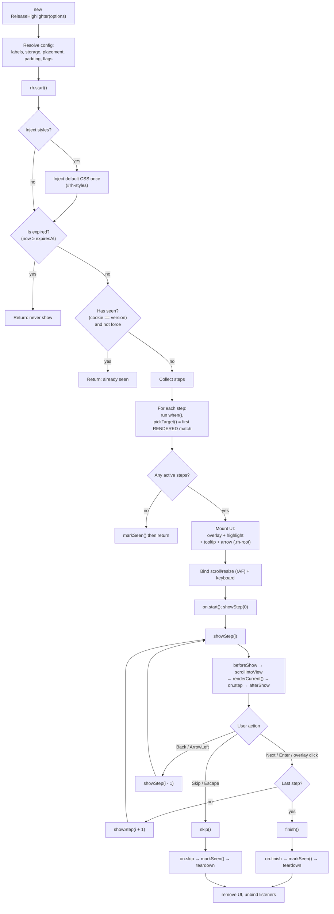

# release-highlighter
<p>
  
  
  
</p>

Simple **release-journey / product-tour** plugin for the web.
Define steps in a JSON file, point them at CSS selectors, and it walks users
through what's new with an overlay, spotlight, and tooltip.

Zero runtime dependencies. Ships ESM, CJS, and a browser IIFE.


## Install

```bash
npm install @inandi/release-highlighter
```

Or via CDN (browser global `ReleaseHighlighter`):

```html
<script src="https://unpkg.com/@inandi/release-highlighter"></script>
```

## Quick start

1. Add a JSON manifest:

```json
{
  "version": "2.1.0",
  "expires": "2026-12-31T23:59:59Z",
  "steps": [
    { "target": ".cart-summary", "title": "New cart", "body": "Totals are clearer.", "placement": "bottom" },
    { "target": "#avatar", "body": "Upload SVG avatars." },
    { "target": ".sidebar a", "body": "Jump around faster." }
  ]
}
```

2. Load it and start:

```ts
import { ReleaseHighlighter } from "@inandi/release-highlighter";

const rh = await ReleaseHighlighter.fromJson("/release.json");
await rh.start();
```

`version` is used for "show once" persistence. `expires` is optional (UTC / ISO);
on or after that moment the journey is never shown.

### Force show (dev / demos)

```ts
const rh = await ReleaseHighlighter.fromJson("/release.json", { force: true });
await rh.start();
```

## Manifest step fields

| Field | Type | Description |
| --- | --- | --- |
| `target` | `string` | **Required.** CSS selector of the element to spotlight. |
| `title` | `string` | Optional heading. |
| `body` | `string` | Optional body text. |
| `html` | `boolean` | Treat `title`/`body` as HTML. |
| `placement` | `"auto" \| "top" \| "bottom" \| "left" \| "right"` | Tooltip side. |
| `padding` | `number` | Spotlight gap (px). |
| `labels` | `{ next?, prev?, skip?, done? }` | Per-step button labels. |
| `scrollIntoView` | `boolean` | Scroll target into view before showing. |

## Options (`fromJson` second argument)

| Option | Default | Description |
| --- | --- | --- |
| `force` | `false` | Always show, ignore stored "seen" state. |
| `theme` | – | Colors, radius, font, `darkMode`, `zIndex`. |
| `labels` | `Next/Back/Skip/Done` | Global control labels. |
| `storage` | `'cookie'` | `'cookie' \| 'localStorage' \| 'memory'`. |
| `storageKey` | `release_highlighter` | Persistence key. |
| `cookieDays` | `180` | Cookie lifetime. |
| `placement` | `'auto'` | Default tooltip placement. |
| `padding` | `8` | Default spotlight gap (px). |
| `scrollIntoView` | `true` | Scroll targets into view. |
| `closeOnOverlayClick` | `true` | Advance on overlay click. |
| `keyboard` | `true` | Arrow / Enter / Escape. |
| `skipHiddenTargets` | `true` | Skip steps with missing/hidden targets. |
| `injectStyles` | `true` | Inject default CSS. |
| `classPrefix` | – | Extra class prefix on UI elements. |
| `on` | – | Lifecycle hooks (`start`, `step`, `next`, `prev`, `skip`, `finish`). |

## Theming

```css
.rh-root {
  --rh-accent: #10b981;
  --rh-radius: 14px;
  --rh-bg: #0b1220;
  --rh-text: #f5f7fa;
}
```

Or via `theme: { accent: "#4f80ff", radius: "10px", darkMode: "auto" }`.

If you manage CSS yourself, set `injectStyles: false` and import:

```ts
import "@inandi/release-highlighter/styles.css";
```

## Public API

```ts
const rh = await ReleaseHighlighter.fromJson("/release.json");
await rh.start();
rh.next();
rh.prev();
rh.goTo(0);
rh.skip();     // marks as seen
rh.finish();   // marks as seen
rh.destroy();  // tear down without marking as seen
```

## Demo (run locally)

```bash
npm install
npm run build
npm run dev
# open http://localhost:5174/demo/
```




The dev server the repo root at `http://localhost:5174/`. Open the `/demo/` page to try it out.
The demo runs a journey from a JSON manifest. Serve it over HTTP (not `file://`)
because the manifest is fetched with `fetch()`.

## License

MIT
