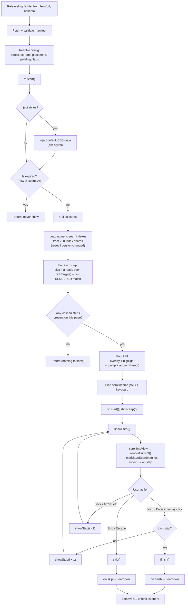

# release-highlighter
<p>
  
  
  
</p>

Simple **release-journey / product-tour** plugin for the web.
Define steps in a JSON file, point them at CSS selectors, and it walks users
through what's new with an overlay, spotlight, and tooltip.

Zero runtime dependencies. Ships ESM, CJS, and a browser IIFE.


## Quick start

Every setup is the same 2 steps: **(1)** create a JSON manifest, **(2)** point
Release Highlighter at it and call `start()`.

### 1. Create a manifest (`release.json`)

Each step targets an element by its **CSS class name** (`targetClass`, no leading dot).

```json
{
  "version": "2.1.0",
  "steps": [
    { "targetClass": "cart-summary", "title": "New cart", "body": "Totals are clearer.", "placement": "bottom" },
    { "targetClass": "profile-avatar", "body": "Upload SVG avatars." },
    { "targetClass": "sidebar-link", "body": "Jump around faster." }
  ]
}
```

Serve it over HTTP so it can be fetched (not `file://`).

### 2a. Use with npm (bundlers / frameworks)

```bash
npm install @inandi/release-highlighter
```

```ts
import { ReleaseHighlighter } from "@inandi/release-highlighter";

const rh = await ReleaseHighlighter.fromJson("/release.json");
await rh.start();
```

Default styles are injected automatically. To ship your own CSS instead, set
`injectStyles: false` and import the stylesheet yourself:

```ts
import "@inandi/release-highlighter/style.css";
```

### 2b. Use via CDN (plain HTML, no build step)

Drop one `<script>` tag on the page. It exposes a global `ReleaseHighlighter`
and injects its own CSS — nothing else to include.

```html
<!-- Pin a version for production; drop @1.1.6 to always get latest -->
<script src="https://unpkg.com/@inandi/release-highlighter@1.1.6"></script>
<script>
  window.addEventListener("DOMContentLoaded", async () => {
    const rh = await ReleaseHighlighter.fromJson("/release.json");
    await rh.start();
  });
</script>
```

> jsDelivr works too: `https://cdn.jsdelivr.net/npm/@inandi/release-highlighter@1.1.6`

`version` scopes persistence: each step is shown once per version (tracked by
its numeric position in the manifest), so steps on different pages keep
appearing until each has been seen. **Omit `version` and nothing is persisted**
— the journey can reappear on every visit. Bumping `version` resets progress and
shows everything again. Keep step order stable within the same version; use a
new version whenever steps are inserted, removed, or reordered. Duplicate
`targetClass` values are allowed and tracked as separate steps. `expires` is
optional (UTC / ISO); on or after that moment the journey is never shown.

### Force show (dev / demos)

```ts
const rh = await ReleaseHighlighter.fromJson("/release.json", { force: true });
await rh.start();
```

## Manifest step fields

| Field | Type | Description |
| --- | --- | --- |
| `targetClass` | `string` | **Required.** Bare CSS class name of the element to spotlight (no leading dot). |
| `title` | `string` | Optional heading. |
| `body` | `string` | Optional body text. |
| `html` | `boolean` | Treat `title`/`body` as HTML. |
| `placement` | `"auto" \| "top" \| "bottom" \| "left" \| "right"` | Tooltip side. |
| `padding` | `number` | Spotlight gap (px). |
| `labels` | `{ next?, prev?, skip?, done? }` | Per-step button labels. |
| `scrollIntoView` | `boolean` | Scroll target into view before showing. |

## Options (`fromJson` second argument)

| Option | Default | Description |
| --- | --- | --- |
| `force` | `false` | Always show, ignore stored "seen" state. |
| `theme` | – | Colors, radius, font, `darkMode`, `zIndex`. |
| `labels` | `Next/Back/Skip/Done` | Global control labels. |
| `storage` | `'cookie'` | Built-in cookie store, or a custom `StorageAdapter`. |
| `storageKey` | `release_highlighter` | Base key. Internal keys are `${storageKey}.seen.meta` and `${storageKey}.seen.N`. |
| `cookieDays` | `180` | Cookie (+ internal mirror) lifetime. `0` = session cookies, no mirror. |
| `placement` | `'auto'` | Default tooltip placement. |
| `padding` | `8` | Default spotlight gap (px). |
| `scrollIntoView` | `true` | Scroll targets into view. |
| `closeOnOverlayClick` | `true` | Advance on overlay click. |
| `keyboard` | `true` | Arrow / Enter / Escape. |
| `skipHiddenTargets` | `true` | Skip steps with missing/hidden targets. |
| `injectStyles` | `true` | Inject default CSS. |
| `classPrefix` | – | Extra class prefix on UI elements. |
| `on` | – | Lifecycle hooks (`start`, `step`, `next`, `prev`, `skip`, `finish`). |

## Theming

```css
.rh-root {
  --rh-accent: #10b981;
  --rh-radius: 14px;
  --rh-bg: #0b1220;
  --rh-text: #f5f7fa;
}
```

Or via `theme: { accent: "#4f80ff", radius: "10px", darkMode: "auto" }`.

If you manage CSS yourself, set `injectStyles: false` and import:

```ts
import "@inandi/release-highlighter/style.css";
```

## Public API

```ts
const rh = await ReleaseHighlighter.fromJson("/release.json");
await rh.start();
rh.next();
rh.prev();
rh.goTo(0);
rh.skip();     // end this run; unseen remaining steps stay eligible
rh.finish();   // finish after displayed steps were recorded
rh.destroy();  // tear down; unseen remaining steps stay eligible
```

## Demo (run locally)

```bash
npm install
npm run build
npm run dev
# open http://localhost:5174/demo/
```



Persistence is **per step**: each step is recorded by its numeric manifest index
the moment it is displayed. Seen indexes are split automatically into shards of
250, so Release Highlighter does not impose a fixed manifest step limit.

The default backend is **cookie**. Each shard is a separate cookie, hardened with
an internal mirror so progress survives rejected or evicted cookies. A shared
metadata cookie holds one journey-level expiry for all shards. Mirror-only data
is ignored unless that metadata is still valid, so orphan mirrors cannot outlive
`cookieDays`.

To use your own store, pass a custom `StorageAdapter` — custom adapters are used
as-is (no mirror):

```ts
const rh = await ReleaseHighlighter.fromJson("/release.json", {
  storage: {
    get: (key) => window.localStorage.getItem(key),
    set: (key, value) => window.localStorage.setItem(key, value),
    remove: (key) => window.localStorage.removeItem(key),
  },
});
```

Browser storage quotas still apply. Shard keys are reused across versions and
each stored value includes the manifest `version`. A version change invalidates
prior indexes automatically.


The dev server serves the repo root at `http://localhost:5174/`. Open the `/demo/` page to try it out.
The demo runs a journey from a JSON manifest. Serve it over HTTP (not `file://`)
because the manifest is fetched with `fetch()`.

## Notes & edge cases

- **Serve the manifest over HTTP.** It is loaded with `fetch()` using
  same-origin credentials; `file://` will not work. A cross-origin manifest URL
  needs proper CORS headers.
- **Failures never break the host page.** An invalid/unreachable manifest or a
  runtime error is caught and logged with `console.warn`; the tour simply does
  not show.
- **Run in the browser.** `fromJson()` / `start()` need `document` and `fetch`,
  so call them client-side (e.g. after `DOMContentLoaded`), not during SSR.
- **Missing or hidden targets are skipped** (`skipHiddenTargets`, default
  `true`). Only the **first** matching element per `targetClass` is used, and
  the step count stays stable regardless of scroll position.
- **Multi-page tours** work: seen steps are remembered by manifest index across
  pages, so remaining steps keep appearing on later pages until all are seen.
- **`html: true` inserts trusted HTML.** Only enable it for content you control
  — untrusted strings are an XSS risk.
- **Bump `version` on any change** to step order (insert / remove / reorder).
  Reusing a version with a different order remaps previously "seen" steps.
- **Omit `version` → nothing persists**; the tour can reappear on every visit
  (a `console.warn` is emitted when steps exist but no version is set).
- **`expires` must be an ISO/UTC date string.** An invalid value throws at load;
  on or after that instant the tour never shows.
- **If cookies are blocked**, persistence is unavailable: the tour reappears and
  a single `console.warn` is logged. Provide a custom `StorageAdapter` to use a
  different store.

## License

MIT
